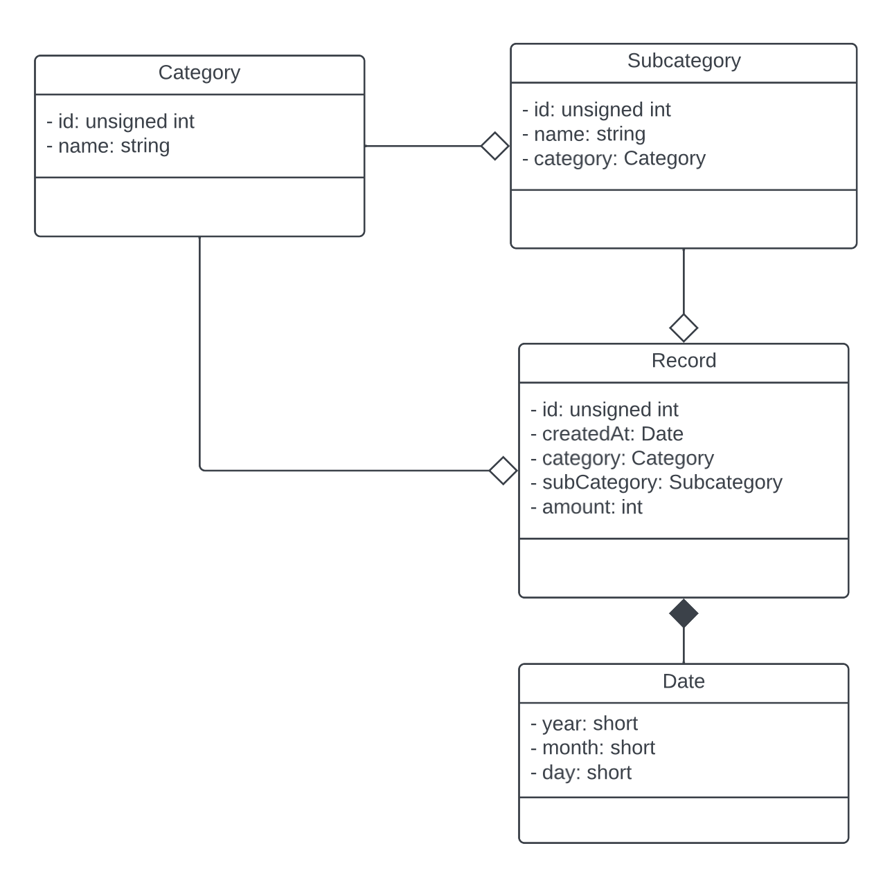

# BudgetWise

> This is the final project of the _2023FA
CSC-284-WB_ in BHCC. The requirements of this project is in [Google Docs](https://docs.google.com/document/d/1h_e2R88jX2n8EN1o4uLtIx0yrgCMuwTPUCg5vXB3qNA/edit). \
> This is a **private repository** on [GitHub](https://github.com/typinghare/advanced-cpp-bhcc/tree/main/src/final).

BudgetWise is a graphical budget/expense tracker. It allows user to enter income and expense, and.

See [User Story](./doc/user_story.md) to understand more about BudgetWise.

## UML Diagrams

The UML diagrams are edited on [Lucid](https://lucid.app/lucidchart/902fa5b3-1783-4363-86a5-249380d1ddd5/edit).

